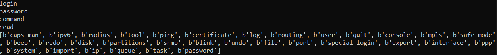

# micoto
Mikrotik Configuration Tool

## Functioning telnet version using tab instead of f1 (help).

## Finally - config tree (without tool, log, terminal, partitions, console, disk, certificate)
CAPS-MAN\
-aaa
-datapath
-rates
-access-list
-interface
--possible-channels
--scan
--hw-info
--reselect-channel
-registration-table
-actual-interface-configuration
-manager
--interface
-remote-cap
--provision
--set-identity
--upgrade
-channel
-provisioning
-security
-configuration
-radio
--hw-info
--provision

IPV6\
-address
-dhcp-server
--binding
--option
-neighbor
-settings
-dhcp-client
--option
--release
--renew
-firewall
--address-list
--connection
--filter
--mangle
--nat
--raw
-pool
--used
-dhcp-relay
--routes
-nd
--prefix
-route

RADIUS\
-incoming

ROUTING\
-bfd
--configuration
--session
-id
-pimsm
--bsr
--interface
--static-rp
--igmp-interface-template
--interface-template
--uib-g
--instance
--neighbor
--uib-sg
-settings
-bgp
--advertisements
--session
--vpls
--connection
--template
--vpn
-igmp-proxy
--interface
--mfc
-rip
--instance
--interface-template
--neighbor
--interface
--keys
--static-neighbor
-stats
--memory
--origin
--pcap
--process
--step
--info
-fantasy
-isis
--instance
--interface-template
--neighbor
--interface
--lsp
-route
--rule
-table
-filter
--chain
--community-list
--select-rule
--community-ext-list
--num-list
--community-large-list
--rule
--test-as-path-regexp
-nexthop
--dump-dot
-rpki
--session
--rpki-query
--rpki-check
-gmp
-ospf
--area
--interface
--lsa
--static-neighbor
--instance
--interface-template
--neighbor
-rule

USER\
-aaa
-settings
-active
--request-logout
-ssh-keys
--private
-group

MPLS\
-forwarding-table
-ldp
--accept-filter
--neighbor
--advertise-filter
--remote-mapping
--interface
--local-mapping
-settings
-interface
-mangle
--reset-counters-all
-traffic-eng
--flow
--interface
--path
--tunnel

SNMP\
-community

FILE\

PORT\
-remote-access

INTERFACE\
-6to4
-l2tp-ether
-pptp-client
-bonding
--monitor-slaves
-l2tp-server
--server
-pptp-server
--server
-bridge
--calea
--mdb
--port
--filter
--msti
--settings
--host
--nat
--vlan
-list
--member
-sstp-client
-detect-internet
--state
-lte
--apn
--esim
--firmware-upgrade
--scan
--settings
--at-chat
--show-capabilities
--cell-monitor
-sstp-server
--server
-dot1x
--client
--server
-macsec
--profile
-veth
-eoip
-macvlan
-vlan
-eoipv6
-mesh
--fdb
--port
--traceroute
-vpls
-ethernet
--switch
--reset-mac-address
--cable-test
-ovpn-client
--import-ovpn-configuration
-vrrp
-gre
-ovpn-server
--server
-vxlan
--fdb
--vteps
-gre6
-ppp-client
--info
--at-chat
--firmware-upgrade
--scan
-wifi
--aaa
--access-list
--reset-mac-address
--cap
--devel
--roam
--capsman
--scan
--channel
--configuration
--sniffer
--datapath
--spectral-history
--interworking
--spectral-scan
--provisioning
--flat-snoop
--radio
--frequency-scan
--wps-client
--registration-table
--wps-push-button
--security
--steering
-ipip
-ppp-server
-wireguard
--peers
--wg-export
--wg-import
-ipipv6
-pppoe-client
--scan
-wireless
--access-list
--sniffer
--align
--snooper
--cap
--wds
--channels
--connect-list
--reset-mac-address
--info
--scan
--interworking-profiles
--manual-tx-power-table
--setup-repeater
--nstreme
--spectral-history
--nstreme-dual
--spectral-scan
--registration-table
--frequency-monitor
--wps-client
--security-profiles
--wps-push-button
-l2tp-client
-pppoe-server
--server

PPP\
-aaa
-active
-l2tp-secret
-profile
-secret

SYSTEM\
-backup
--cloud
--load
--save
-logging
--action
-clock
--manual
-note
-ntp
--client
--key
--server
--monitor-peers
-default-configuration
--caps-mode-script
--custom-script
--script
-package
--local-update
--uninstall
--update
--downgrade
--unschedule
--apply-changes
-device-mode
--update
-resource
--cpu
--irq
--pci
--usb
-health
-routerboard
--mode-button
--settings
--wps-button
--upgrade
--reset-button
--usb
-history
-rtrace
--start
--stop
-identity
-scheduler
-leds
--settings
-script
--run
--job
-license
--output
-watchdog

IP\
-address
-dns
--adlist
--forwarders
--cache
--static
-nat-pmp
--interfaces
-service
-traffic-flow
--ipfix
--target
-arp
-firewall
--address-list
--connection
--layer7-protocol
--nat
--service-port
--calea
--filter
--mangle
--raw
-neighbor
--discovery-settings
-settings
-upnp
--interfaces
-cloud
--advanced
--force-update
-hotspot
--active
--profile
--cookie
--service-port
--reset-html
--host
--user
--ip-binding
--walled-garden
--setup
-packing
-smb
--shares
--users
-vrf
-dhcp-client
--option
--release
--renew
-ipsec
--active-peers
--key
--policy
--settings
--identity
--mode-config
--profile
--statistics
--installed-sa
--peer
--proposal
-pool
--used
-socks
--access
--users
--connections
-dhcp-relay
-kid-control
--device
--pause
--resume
-proxy
--access
--direct
--clear-cache
--cache
--inserts
--cache-contents
--lookups
--reset-html
--connections
--refreshes
-dhcp-server
--alert
--matcher
--config
--network
--lease
--option
--setup
-media
--settings
-route
--check
-tftp
--settings

QUEUE\
-interface
-simple
--reset-counters-all
-tree
--reset-counters-all
-type