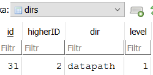
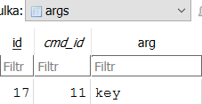
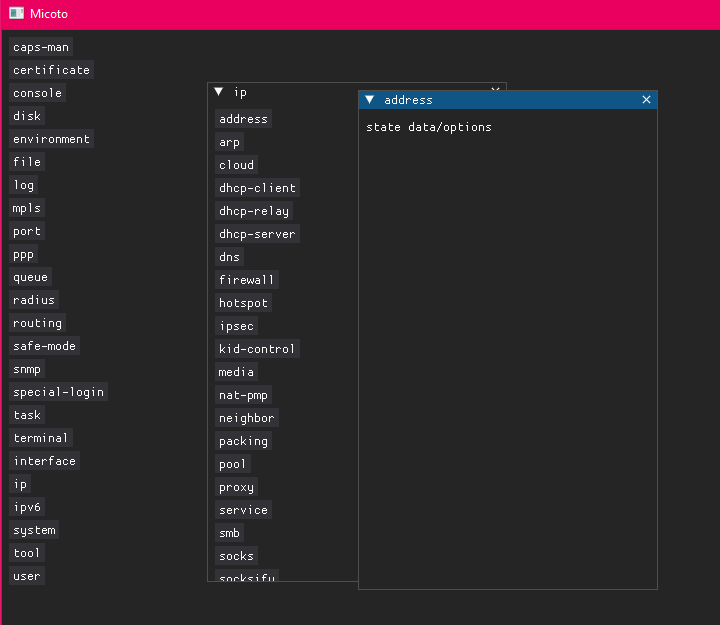

# micoto
Mikrotik Configuration Tool

## Finally - config tree
Config tree in DB using system of levels.

*Example of dirs's table record*\

*Example of cmds's table record*\

*Example of args's table record*\

## Passible gui appearance
