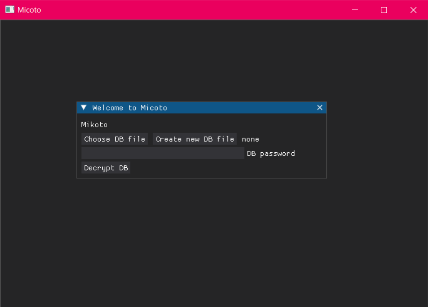
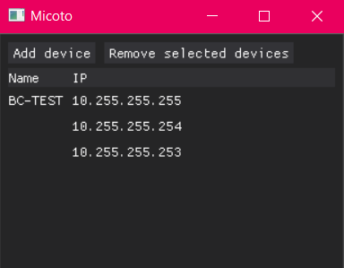
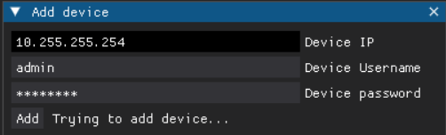
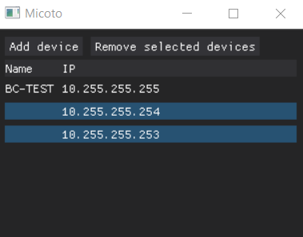

# micoto
Mikrotik Configuration Tool

This programme is part of my bachelor's degree. Current state is SEMESTRAL THESIS of this project.

## Welcome screen
At lunch the app welcomes you with dialog show below. You can choose to use existing DB file or create new. 

## Main window
There is a view of the main app window. Now it consist of devices saved in DB file and self-explanatory function buttons. 

## Device management
### Adding device
The picture shows the process of adding new device after clicking "Add" button. You have to fill the device ip field as well as device username and password. 

### Deleting
Process of deleting items is shown below. You can select one or multiple rows at once and simply remove them by pressing "Remove selected devices". Given rows are deleted from the DB immediately. The whole table of devices is refreshed so that only devices which exists in DB are shown. 
