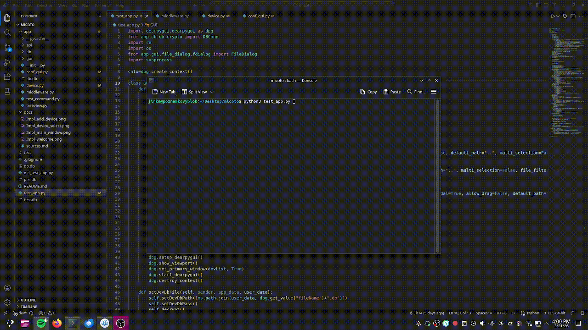
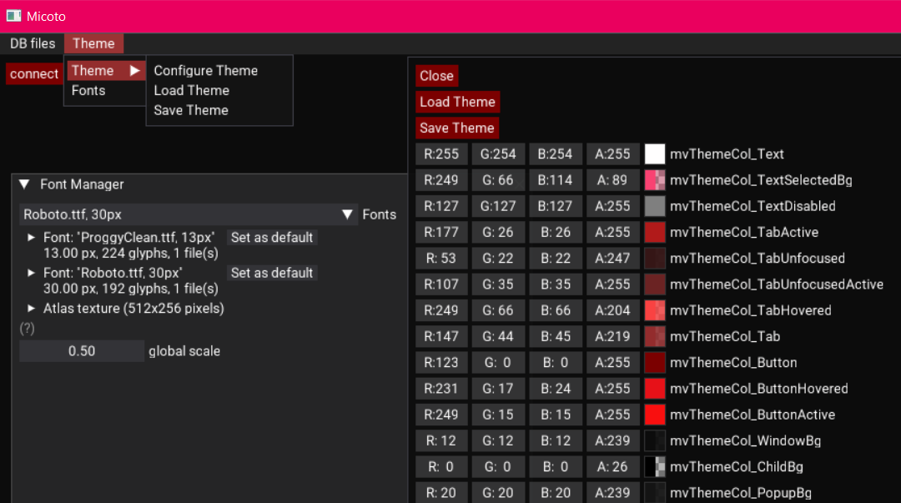

# micoto
Mikrotik Configuration Tool

This programme is part of my bachelor's degree. Current state of this project is BACHELOR THESIS.

The programme can be run by `py test_app.py`.

## Running app

## Theme customization

## App is using these libraries/addons
## sqlite3
[sqlite3 docs](https://docs.python.org/3/library/sqlite3.html)

## cryptography
[cryptography docs](https://cryptography.io/en/latest/hazmat/primitives/symmetric-encryption/)

## DearPyGui
[DearPyGui github](https://github.com/hoffstadt/DearPyGui)

## Theme Plugin
[DearPyGui_EditThemePlugin](https://github.com/awcook97/DearPyGui_EditThemePlugin)

# Requirements
sqlite3, dearpygui, cryptography
Run `pip install dearpygui cryptography`.
